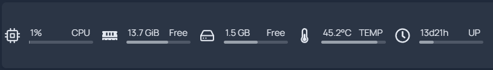

# Show PVE host system load on Homepage LXC

[Homepage][homepage] is a customizable "home page" or "dashboard" that you can
host yourself. I have to say the name of the project is really bad. It is very
hard to google it, since the vast majority of "homepage" hints will not be this
repo.


Screenshot from the README in the official repo.

There is a "widget" that allows you to monitor the system load

```yaml
- resources:
    cpu: true
    cputemp: true
    memory: true
    uptime: true
    disk: /
```

which looks like this



However, there is a problem. The widget to get system info is hardcoded

```js
cpuinfo = fs.readFileSync('/proc/cpuinfo', { encoding: 'utf8' }).toString().split('\n');
```

which means that you can only see the stats of Homepage's own host. In my (and
many other people's) case, Homepage is running inside a LXC running on PVE,
which means it is meaningless to show the stats. After all, why do you even
bother with the "system load" for a container that only runs Homepage. You will
never run out of resources anyway. To show the stats of the PVE host, we need
apply some hacks.

This post was originally based on my comments over [a GitHub issue][issue]. As
of now (Mar 3, 2024), Homepage already built in the possibility to monitor
another machine. Take a look [here][new]. However, it looks like you need some
sort of API to report these values from another machine. I am pretty sure you
can do this for Proxmox, but I feel this hacky approach is still useful when all
you need is the stats of the host.

## Hacks

First, let us mount your PVE's `/proc` folder to somewhere else, for example,
`/mnt/proc` 

```shell
# mount /proc to /mnt/proc
mount -t proc proc /mnt/proc
```

You can add this line to PVE's `/etc/fstab` to make it persist.

Next, bind mount `/mnt/proc` to your LXC that hosts Homepage. Just add this line
to the configuration file

```conf
lxc.mount.entry: /mnt/proc proc none bind,create=dir
```

such that this LXC's `/proc` will be identical to `/mnt/proc` which again is the
same as the host's `/proc`. For some reason, directly mounting the host's
`/proc` to the LXC will make it non-bootable. This is the reason we have to do
it this way.

Now, your Homepage widgets should show your host's system load.

[homepage]: https://github.com/gethomepage/homepage
[issue]: https://github.com/gethomepage/homepage/issues/210#issuecomment-1565088878
[new]: https://gethomepage.dev/latest/widgets/services/glances/