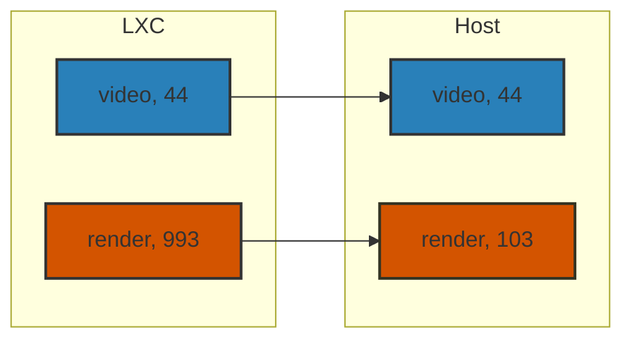

# Host immich in LXC with iGPU passthrough

After trying several self-hosted photo services, I finally settled down with
[immich][immich github]. While it is quick and easy to set up immich with
docker, I have always been trying to run it directly inside an LXC. The main
reason is hardware acceleration. You can run docker inside a privileged LXC
(which is discouraged) or a VM. Correct me if I am wrong, but if you pass the
GPU to the VM, you can no longer pass it to other LXCs, which is apparently a
deal breaker. Thanks to the hard work by GitHub user [loeeeee][loeeeee], which
largely formed the foundation of this post.

## Install

`loeeeee` have already developed a good writeup on how to set up the LXC, so
here I will simply add a few things that could mess up or be improved.

### Python version on Ubuntu

As of now, Ubuntu LTS (24.04) is shipped with Python 3.12 by default. For
hardware acceleration with you iGPU, you need the
[openvino package][openvino github] from Intel. At this moment, immich only
supports `onnxruntime-openvino=0.18.0`. As you can see from
[pypi][openvino pypi], this version is only built for Python 3.11. This means
you either install Python 3.11 yourself for immich or build the wheel yourself
for Python 3.12. Apparently, the first approach is more cost effective.

On a my daily driver, I would definitely use `conda` to manage Python versions,
but it just seems to be too much hassle for a server. I decided to install
Python though `apt`.

The following commands expects you to run in `root` and you likely will.

```shell
add-apt-repository ppa:deadsnakes/ppa
apt update
apt install python3.11 python3.11-venv python3.11-dev
ln -sf /usr/bin/python3.11 /usr/bin/python3
```

Note that we are overwriting the default Python version of the system to make
our life easier. This change will be reverted back later.

### GPU passthrough

There are lots of posts online regarding this part. In short, this process
requires bind mounting of devices related to the iGPU and [id mapping][mapping].
However, I did struggle a lot initially when doing the id mapping stuff, so I
guess it does not hurt to have one more post to explain this.

Here is my id mapping for the immich LXC running on Ubuntu 24.04 (i.e., very
likely this mapping will for you out of box as well if you using Ubuntu from
Proxmox' official template).

```conf
lxc.cgroup2.devices.allow: c 226:0 rwm
lxc.cgroup2.devices.allow: c 226:128 rwm
lxc.mount.entry: /dev/dri dev/dri none bind,optional,create=dir
lxc.idmap: u 0 100000 65536
lxc.idmap: g 0 100000 43
lxc.idmap: g 44 44 1
lxc.idmap: g 45 100045 55
lxc.idmap: g 100 100 1
lxc.idmap: g 101 100101 892
lxc.idmap: g 993 103 1
lxc.idmap: g 994 100994 64541
```

The idea of id mapping could be quite confusing. To be honest, I struggled quite
a lot in the beginning. But here is my summarization for what you should do

> The key part for id mapping is that you need map all groups (or users) on the
> LXC from 0 to 65535 to the host's user or group ids. No repetitions or gaps are
> allowed, but you have the freedom to chop the whole range into how many segments
> you want. The mapped id on the host side does not have to consecutive, as long
> as different ranges have no overlap.

> For iGPU passthrough, you need to map the group owning `/dev/dri/card0` and
> `/dev/dri/renderD128` on the host to the same group ids inside the LXC. This
> will "chop" the whole range into segments and you need to apply the principles
> we have talked about above.

For example, on my host, the `/dev/dri` looks like this
```shell
> ls -l /dev/dri                                                                                       
total 0
drwxr-xr-x  3 root root        100 Aug 12 22:41 .
drwxr-xr-x 22 root root       5.4K Aug 15 23:29 ..
drwxr-xr-x  2 root root         80 Aug 12 22:41 by-path
crw-rw----  1 root video  226,   0 Aug 12 22:41 card0
crw-rw-rw-  1 root render 226, 128 Aug 12 22:41 renderD128
```
You can see that we have to map the `video` group to my LXC's `video` group and
the `render` group  to my LXC's `render` group. 

Next, by looking up `/etc/group` on both sides, we can see that we need the
following mappings.



This corresponds to the following lines in the id mapping.
```conf
lxc.idmap: g 44 44 1
lxc.idmap: g 993 103 1
```

I additionally did a group mapping for the `user` group (100), which I have
forgot why, but presumably due to some permission issues on file handlings. 

After the key part of mapping is determined, all you have to do it two fill in
the rest of the gid's to make sure there is no gaps or overlaps. Especially,
from here, you can see that the id's on the host do not have to be consecutive.
```conf
lxc.idmap: g 993 103 1
lxc.idmap: g 994 100994 64541
```

### Build and install immich

Again, just follow [loeeeee's readme][readme]. One thing to note, after the
installation, you need to change the default Python version back to 3.12, as
the `python-apt` package is needed for `apt` to work properly, but installing it
for Python 3.11 is rather complicated. 

To keep the ML part of immich working, we need explicitly tell immich-ml to use
python 3.11. Assume you have installed immich to the default location
`/home/immich`, run the following commands as `immich` user (not root):
```shell
ln -sf /usr/bin/python3.11 /home/immich/app/machine-learning/venv/bin/python
ln -sf /usr/bin/python3.11 /home/immich/app/machine-learning/venv/bin/python3
ln -sf /usr/bin/python3.11 /home/immich/app/machine-learning/venv/bin/python3.11
```

Now switch back to root and change the default Python version back to 3.12.
```shell
ln -sf /usr/bin/python3.12 /usr/bin/python3
```

## Build the server automatically with GitHub Actions

Now, this is the part that I am really want to talk about. If you have followed
the setup guide, you will find how tedious it is. Even worse, you have to
manually bump up the immich version in `install.env`, run `install.sh`, wait for
many minutes for the building to finish. EVERY SINGLE TIME when there is a new
release.

Does it sound bad to you? It does to me. So I wrote a GitHub workflow to
automatically build the server with `openvino` (so iGPU for ML) upon a new
immich release is detected, pack the server `app` and the reversed geo coding
part `geodata`, and publish a release. The workflow is triggered everyday around
10 PM EST or manually by you. You can find the workflow [here][my actions].

Apart from saving the efforts of building the server manually, as (in principle)
every major version since v1.133.0 (I had not developed the workflow before this
point) has been built and published in my repo, restoring to any previous
version is as easy as downloading the release and unpacking it. This is
especially useful if you want to roll back to a previous version for whatever
reason.

You can of course directly download my release [here][my release], and simply
unpack it with the `immich` user 
```shell
cd /home/immich
wget -O server.tar.gz "https://github.com/tautomer/immich-in-lxc/releases/latest/download/server.tar.g
mv app app.old
mv geodata geodata.old
tar -xf server.tar.gz
rm server.tar.gz
```

However, there is catch. To build the server, an environment variable
`$UPLOAD_DIR` has to be passed to the workflow, which is crucial if you use
immich to handle the assets themselves. As I completely use external libraries
sitting on my NAS' NFS share `/mnt/photos`, I simply linked the upload directory
(which will appear on the installed server as `/home/immich/app/upload`) to 
`/mnt/photos/.immich`. This will 100% percent break for you, so you have to link
it to your own upload directory.
```shell
ln -sf /your/upload/path /home/immich/app/upload
```
Again, run this with the `immich` user, not root.

Alternatively, you can also fork my repo and do your own release.

### If you want to build the server yourself

To build the server yourself, you need to fork my repo and set up a few repo
secrets and variables.

1. First, fork my repo (of course....)
2. Head to [your GitHub settings for personal access tokens][pat]
3. Generate a fine-grained personal access token for your fork
   `your-github-username/immich-in-lxc` with the permissions of 
   `Read access to metadata` and 
   `Read and Write access to actions, actions variables, code, and workflows`.

   ![PAT Screenshot][pat screenshot]

   Click `+ Add permissions` and enter `actions` and `metadata` in the search
   box.
4. Copy the token and add it to your fork's repo secrets as `ACTIONS_PAT`. Note
   that, this step is in your fork settings, not your account settings.
   `https://github.com/your-username-here/immich-in-lxc/settings/secrets/actions`
5. Next, add repo variables. The tab is next to the secrets tab. Add the
   following variables:
   - `UPLOAD_DIR`: The upload directory for immich, which is the same as the
     one you linked to `/home/immich/app/upload` above.
   - `LATEST_IMMICH_RELEASE`: The latest immich release version that the
     workflow has built. **This is NOT the version you want to build.** Just
     leave it blank, as it will be handled automatically by the workflow. The
     workflow will grab this value and compare it with the latest official
     immich release. If the immich version is newer than this value, a new
     version will be built and released, and this variable will be
     automatically updated to the new version.
6. Wait until the workflow finish building. You can then download the release
   from your fork. And drop-in replace the `app` and `geodata` directories in
   your current server.

### Automatically update immich from the LXC

To make the update process easier, I wrote a script that can be run inside the
LXC to automatically update immich to the latest version with cron. This script
runs around 10:30 PM EST every day, and checks if there is a new immich. As our
GitHub workflow runs around 10 PM EST and takes about 10 minutes to finish
building, this script will always be able to find the latest immich release if
there is an update that day.

1. Create a script as root. For example, I have
   `/root/check_latest_immich_server.sh`. Two things to note here:
    - Make sure you use your own fork in the `GITHUB_REPO` variable. If you use
      my release, make sure you add one line in the script to properly configure
      the upload directory after the server is extracted 
      `tar -xf server.tar.gz`.
    - If you have email relay setup, change the `ADMIN_EMAIL` variable to
      your own email address. If you do not have email relay setup, you can
      simply remove the email sending part in the script. If you want to set up
      a centralized mail relay, you can follow my post [here][mail relay post].
      
   ```shell
   #!/bin/bash
   set -e
   
   # ===== Configurable settings =====
   LOG_LINES=30
   ADMIN_EMAIL="your@email.com"
   GITHUB_REPO="your_github_username/immich-in-lxc"
   WEB_LOG_FILE="/var/log/immich/web.log"
   ML_LOG_FILE="/var/log/immich/ml.log"
   # =================================
   
   timestamp() { date '+%Y-%m-%d %H:%M:%S'; }
   
   # ===== ANSI escape remover =====
   strip_ansi() {
       sed -r "s/\x1B\[[0-9;]*[mK]//g"
   }
   
   send_success_email() {
       {
           echo "Subject: immich upgraded to $LATEST_TAG"
           echo "To: $ADMIN_EMAIL"
           echo
           echo "Immich successfully upgraded from $PREV_TAG to $LATEST_TAG."
           echo
           echo "Please double-check the server to ensure everything is running smoothly."
       } | sendmail -t
   }
   
   send_failure_email() {
       ML_LOG=$(tail -n "$LOG_LINES" "$ML_LOG_FILE" | strip_ansi || echo "No ML log available")
       WEB_LOG=$(tail -n "$LOG_LINES" "$WEB_LOG_FILE" | strip_ansi || echo "No Web log available")
   
       {
           echo "Subject: immich upgrade FAILED to $LATEST_TAG"
           echo "To: $ADMIN_EMAIL"
           echo
           echo "Immich upgrade FAILED from $PREV_TAG to $LATEST_TAG."
           echo
           echo "Please review the logs below and take corrective actions."
           echo
           echo "=== Last $LOG_LINES lines of ML log ==="
           echo "$ML_LOG"
           echo
           echo "=== Last $LOG_LINES lines of Web log ==="
           echo "$WEB_LOG"
       } | sendmail -t
   }
   
   echo "[INFO] $(timestamp) - Starting Immich update check"
   
   PREV_TAG=$(cat /home/immich/prev_tag 2>/dev/null || echo "")
   LATEST_TAG=$(curl -s https://api.github.com/repos/$GITHUB_REPO/releases/latest | jq -r '.tag_name')
   
   ver_latest="${LATEST_TAG#v}"
   ver_local="${PREV_TAG#v}"
   
   if dpkg --compare-versions "$ver_latest" le "$ver_local"; then
       echo "[INFO] $(timestamp) - No newer release (latest: $LATEST_TAG, local: $PREV_TAG)"
       exit 0
   fi
   
   echo "[INFO] $(timestamp) - New version $LATEST_TAG found. Stopping services..."
   sudo systemctl stop immich-web immich-ml
   
   echo "[INFO] $(timestamp) - Backing up and replacing server files..."
   sudo -u immich bash <<EOF
   set -e
   cd /home/immich
   mv app app.old
   mv geodata geodata.old
   wget -q -O server.tar.gz "https://github.com/$GITHUB_REPO/releases/download/$LATEST_TAG/server.tar.gz"
   tar -xf server.tar.gz
   rm server.tar.gz
   EOF
   
   echo "[INFO] $(timestamp) - Starting services..."
   sudo systemctl start immich-web immich-ml
   echo "[INFO] $(timestamp) - Waiting 30s for services to stabilize..."
   sleep 30
   
   if systemctl is-active --quiet immich-web && systemctl is-active --quiet immich-ml; then
   
       send_success_email
       echo "[INFO] $(timestamp) - Removing backups..."
       sudo -u immich bash <<EOF
       cd /home/immich
       rm -rf app.old geodata.old
       echo "$LATEST_TAG" > prev_tag
   EOF
   
       echo "[INFO] $(timestamp) - Update completed successfully."
   
   else
       echo "[ERROR] $(timestamp) - One or more services failed to start."
   
       echo "[INFO] $(timestamp) - Collecting last $LOG_LINES lines from logs..."
       send_failure_email
       echo "[INFO] $(timestamp) - Restoring previous version..."
       sudo systemctl stop immich-web immich-ml
       sudo -u immich bash <<EOF
       cd /home/immich
       rm -rf app geodata
       mv app.old app
       mv geodata.old geodata
   EOF
   
       sudo systemctl restart immich-web immich-ml
       echo "[INFO] $(timestamp) - Restore complete."
   fi

   ``` 

2. Make the script executable
   ```shell
   chmod +x /root/check_latest_immich_server.sh
   ```
3. Add a cron job to run the script every day at 10:30 PM EST. You can use the
   following command to add it to your crontab: 
   ```shell
   echo "30 2 * * * /root/check_latest_immich_server.sh >> /var/log/cron_immich_update.log 2>&1" | crontab -
   ```
   Note that the time is in UTC, so you need 2:30 AM UTC to get 10:30 PM EST.

This script will check if there is a new immich release, and if so, it will stop
the immich services, download the latest immich server release, extract it, and
start the services again. If either services fails for whatever reason in 30s,
it will send an email to you with the last 30 lines of the ML and web logs, and
restore the previous version of the server. If the services start successfully,
it will send an email to you with the success message and remove the old server
files. If you want to change the number of lines sent, simply change the
`LOG_LINES` variable at the top of the script.

This will make sure you always have a working immich server, even if the latest
automatic build fails for some reason.

## Conclusion

With this setup, you can now run immich directly inside an LXC with iGPU
passthrough. You can also enjoy the convenience of automatic updates with GitHub
Actions. This setup is not only more efficient but also allows you to utilize
the hardware acceleration capabilities of your iGPU for machine learning tasks
and transcoding.
If you have any questions or suggestions, feel free to reply here or open an issue
in my fork or loeeeee's upstream repo (I do check his repo from time to time).

[immich github]: https://github.com/immich-app/immich
[loeeeee]: https://github.com/loeeeee/immich-in-lxc
[readme]: https://github.com/loeeeee/immich-in-lxc#
[openvino github]: https://github.com/openvinotoolkit/openvino
[openvino pypi]: https://pypi.org/project/onnxruntime-openvino/1.18.0/#files
[mapping]: https://forum.proxmox.com/threads/understanding-lxc-uid-mappings.101855/
[my actions]: https://github.com/tautomer/immich-in-lxc/actions
[my release]: https://github.com/tautomer/immich-in-lxc/releases/latest
[pat]: https://github.com/settings/personal-access-tokens
[pat screenshot]: /images/homelab/2025-04-10-immich_in_lxc/pat_permissions.png
[mail relay post]: /posts/centralized_mail_relay/
