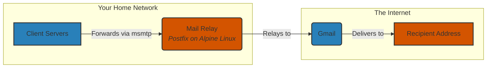

# Set up a centralized mail relay with Postfix
 
This has always been a pain to set up mail relay on every single LXC or VM.
Apart from critical services like Proxmox itself or xpenology, I used to live
without any email notifications from most of my services.

Yesterday, I suddenly realized that I could set up a centralized mail relay
and forward all emails from other servers through it. After some research, I 
finally decided to set up a centralized mail relay using Postfix running inside
a dedicated host and then configure all other servers to relay emails through
it. For other servers, a full solution like Postfix is an overkill, so I used
lighter alternatives like [msmtp](https://wiki.debian.org/msmtp) for simpler
setups. 

## The overall architecture

We use a dedicated Alpine LXC running Postfix as the mail relay. All other
servers (clients) will forward their emails to this mail relay using `msmtp`. As
Macrohard 
[has made it a lot harder to use outlook as a relay service](https://www.reddit.com/r/Outlook/comments/1g56ejp/did_microsoft_recently_discontinued_smtp_support/),
we will use Gmail as the final mail delivery service to deliver emails to your
own mailbox.



## Set up the mail relay

Note that as we are working in the context of LXC/VM inside Proxmox, very likely
you are running as root anyway. If you are not, please prepend `sudo` to all
commands.

1. As usual, set up an Alpine LXC in your Proxmox host. It is hard for me to
   imagine that in a home lab setup you will need any resources for this relay.
   For my own case, the LXC has not used more than 30MB of RAM and 2.5% of 1
   vCPU in the past day.
   
   Even 64MB of RAM should be enough for this LXC.

2. Install Postfix and other dependencies.
   ```shell
   apk update
   apk add postfix
   ```
   Yes, for basic authentication, this is all you need. You do not even even
   need stuff like `cyrus-sasl`.

3. Configure Postfix. Edit the file `/etc/postfix/main.cf` and add the following
   lines at the end of the file.
   ```conf
   myhostname = mail.yourdomain.com
   relayhost = [smtp.gmail.com]:587
   smtp_sasl_auth_enable = yes
   # Alpine uses lmdb instead of hash
   smtp_sasl_password_maps = lmdb:/etc/postfix/sasl_passwd
   smtp_sasl_security_options = noanonymous
   smtp_sasl_mechanism_filter = plain login
   smtp_use_tls = yes
   smtp_tls_security_level = encrypt
   smtp_tls_CAfile = /etc/ssl/certs/ca-certificates.crt
   # Allow other servers on your LAN to relay through this one
   mynetworks = 127.0.0.0/8 [::1]/128 192.168.1.0/24
   ```
   Replace `mail.yourdomain.com` with your own domain name, though it will not
   do anything anyway. The `relayhost` is set to Gmail's SMTP server. If you LAN
   IP is not `192.168.1.x`, change it to your own LAN IP range. 

4. Create an app password for your Google account. Google has 
   [well-written instructions here](https://support.google.com/accounts/answer/185833?hl=en).
   Create a file `/etc/postfix/sasl_passwd` with the following content:
   ```conf
   [smtp.gmail.com]:587  your_email@gmail.com:your_app_password
   ```
   Then create the database
   ```shell
   postmap /etc/postfix/sasl_passwd
   chmod 600 /etc/postfix/sasl_passwd.lmdb
   ```

5. Restart Postfix.
   ```shell
   rc-service postfix restart
   ```
   
6. Now we can test the mail relay. Use the following command to send a test email:
   ```shell
   echo "Subject: Postfix Relay Test Email" | sendmail -v toosimple@outlook.com; tail -f /var/log/messages
   ```
   The log file `/var/log/messages` should show that the email is sent
   successfully. If there are any errors, check the Postfix configuration and
   ensure that the app password is correct and the service is running.
   
7. Finally, the plaintext password is no longer needed, so we remove it for
   security reasons. Run the following command to remove the plaintext password
   file:
   ```shell    
   rm /etc/postfix/sasl_passwd
   ```

## Set up the client servers

Some servers may have Postfix installed already. You can keep using it for
communicating with the mail relay. However, it is really an overkill for this
use case. Consider stopping the service and disabling it. The command could be
distro-specific, so I will not include it here.

1. Install `msmtp` on the client server. For example, on Debian/Ubuntu:
   ```shell
   sudo apt install msmtp 
   ```
   On Alpine, use 
   ```shell
   apk add msmtp
   ```

2. Create the configuration file `/etc/msmtprc`
   ```conf
   account default
   host 192.168.1.100  # LAN IP or hostname of your central mail relay
   port 25
   auth off
   from "A fancy name for your client" <what@ever.yourdomain.com>
   logfile ~/.msmtp.log # /var/log/msmtp.log somehow causes permission issues
   ```
   For the `from` field, you can use any name and email address you like.
   However, Google will not let you use a random email address, so the sender
   address will always be overwritten to your Gmail address. The sender name,
   though, will remain as you set it, so make it something recognizable for each
   client server.

3. Override the default `sendmail` command to use `msmtp`. Create a
   symlink to `/usr/bin/msmtp`:
   ```shell
   mv /usr/sbin/sendmail /usr/sbin/sendmail.bak # optionally back up the original sendmail
   ln -sf /usr/bin/msmtp /usr/sbin/sendmail
   ```
   Some systems have a real `sendmail` binary, so you may want to rename it. For
   systems like Alpine, the `sendmail` command is just a symlink, so you can
   simply overwrite it with `msmtp`. If you are not sure, check it out with `ls
   -l /usr/sbin/sendmail`.

4. Test email from the client
   ```shell
   echo "Subject: relay rename testing" | sendmail -v your@email.com
   ```
   If everything is set up correctly, you should receive the email in your inbox
   shown as sent from "A fancy name for your client (your@gmail.com)".

## Conclusion

With this set up, all your client servers can now send emails through the
central mail relay with minimal configuration. For services like `immich` where
a SMTP server is built-in, you can simply set the SMTP server to the IP address
of the mail relay and port to 25.