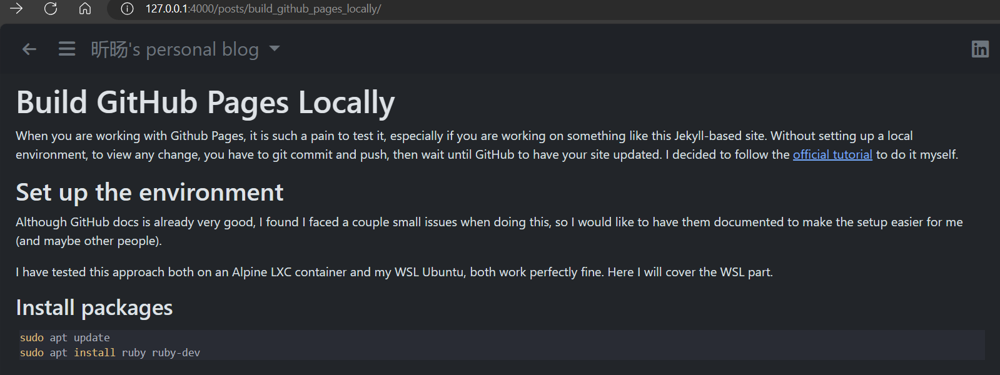

# Build GitHub Pages locally with Jekyll

When you are working with Github Pages, it is such a pain to test it, especially
if you are working on something like this Jekyll-based site. Without setting up
a local environment, to view any change, you have to git commit and push, then
wait until GitHub to have your site updated. I decided to follow the [official
tutorial][tutorial] to do it myself.

## Set up the environment

Although GitHub docs is already very good, I found I faced a couple small issues
when doing this, so I would like to have them documented to make the setup
easier for me (and maybe other people).

I have tested this approach both on an Alpine LXC container and my WSL Ubuntu,
both work perfectly fine. Here I will cover the WSL part.

### Install packages

```shell
sudo apt update
sudo apt install ruby ruby-dev
```

Yes, you need not only Ruby, but also `ruby-dev` which contains some essential
components (like the header files) to build Ruby packages.

Then we need install `bundler`

```shell
gem install bundler -v 2.1.2 --user-install
```
`-v` is used to force installing version 2.1.2. This is mainly because the
current `Gemfile.lock` was build with bundler 2.1.2. If another version is
installed, bundler will first upgrade/downgrade itself anyway. `--user-install`
is used because I do not want to `sudo` every time to install a Ruby package.
With this option, the packages will be installed to `${HOME}/.local/share/gem/`,
and the binaries, like `bundle`, will be installed to
`${HOME}/.local/share/gem/ruby/3.1.0/bin`. You need add this directory to your
`PATH` to use the executables.

The next step, `bundle` will by default try to install packages to directories
like `/usr/local/bin` and `/var/lib/gems/3.1.0`, so `sudo` is obviously needed
as well. As a result, let us change this behavior as well

```shell
bundle config set --local path $HOME/.gem
```

Here, with this option, `bundle` and `gem` will both install the packages to the
same directory.

Next, install necessaries package defined in `Gemfile.lock`

```shell
bundle install
```

To serve the website with `jekyll`, it is necessary to install the `webrick`
package. You can do

```shell
bundle add webrick
```

which will add `webrick` to `Gemfile.lock`. Till now, we are all set! We can now
serve the website

```shell
bundle exec jekyll serve --incremental --livereload
```

Notice the options. `--incremental` will build the site whenever a file is
changed, and `--livereload` will automatically refresh your browser window to
save you some hassle.

Now you should be able to see your page in the browser!



Here is the live view when I am working this very post.

## Some tips

Here are some other issues I encountered.

1. A site built by Jekyll utilize some pre-processors, for example, in
   `posts_chrono.html`
   
   ```html
   <h1><span class="fas fa-clock-rotate-left fa-fw"></span> Posts</h1>
   <ul>
   
   {{% for post in site.posts %\}}
       
       
           {% assign currentdate = post.date | date: "%Y" %}
           
               </ul>
               <h2 id="y{{post.date | date: '%Y'}}">{{ currentdate }}</h2>
               <ul>
               
           
           <li>
               <a href="{{ post.url }}">{{ post.title }}</a> (<i>{{ post.date | date_to_string }}</i>)</br>
               {{ post.description }}
           </li>
           </ul>
       
   
   
   </ul>
   ```

   These are called `liquid syntax` which will be parsed by `Jekyll` to build the
   page. Here this page basically finds all the post and create this
   [posts_chrono](/posts_chrono/) page.
   
   Here comes the problem. I started serving the site and then created this post,
   so is did not exist in the link above so that I could not access this page
   without typing the URL manually. 
   
   To deal with it, I just randomly change `posts_chrono.html` a little bit
   (like add a new line) and save it. The change in the page will trigger
   `Jekyll` to rebuild the page.

2. When you run the command with the `--livereload` option, it will tell you

   ```shell
    Auto-regeneration: enabled for '.'
   LiveReload address: http://127.0.0.1:35729
       Server address: http://127.0.0.1:4000/
   ```

   It seems you should connect to the one with port number 35729, but in fact,
   if you do it, you will see an error prompt saying

   ```text
   This port only serves livereload.js over HTTP.
   ```

   It seems the browser force a HTTPS link, while the script only works for
   HTTP. Actually, you just have to connect to the one at port 4000, and it
   works just fine. I am not sure what is happening here.

3. By default, `jekyll` only serves to `LOCALHOST`. If you want to view the site
   on other device, add CLI option `--host==0.0.0.0` so that `jekyll` will
   listen to all LAN IPv4 addresses. Note that, if you serve the site within
   WSL, other devices cannot access the site. This is because of
   [this issue][issue], and the solution is provided in [this comment][comment].
   I had to run this script to ssh into my WSL before I started doing
   self-hosting.

   You can add the default port 4000 used by `jekyll serve` or whatever you
   want to line 29 of the script

   ```powershell
   #[Ports]

   #All the ports you want to forward separated by coma
   $ports=@(80,443,10000,2222,3000,4000,5000);
   ```

   Then run this script as admin on Windows to add a Windows firewall rule, or
   you can create the rule with the default script and add the port to this rule
   later.

[tutorial]: https://docs.github.com/en/pages/setting-up-a-github-pages-site-with-jekyll/testing-your-github-pages-site-locally-with-jekyll?platform=linux
[issue]: https://github.com/microsoft/WSL/issues/4150
[comment]: https://github.com/microsoft/WSL/issues/4150#issuecomment-504209723